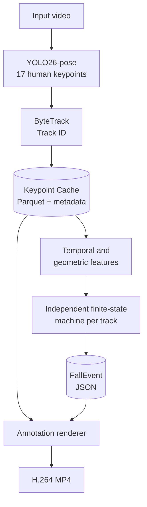
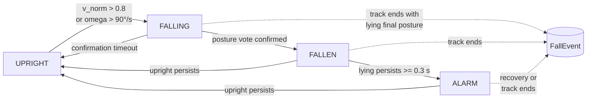

# FallSense: Interpretable Pose-Based Fall Event Detection

[正體中文](README.md) · **English**

[](https://github.com/kuotunyu/fall-detection-pose/actions/workflows/ci.yml)
[](https://github.com/kuotunyu/fall-detection-pose/releases/latest)


[](LICENSE)

FallSense extracts human pose keypoints with **YOLO26-pose**, maintains identities with **ByteTrack**, and detects fall events through an interpretable finite-state machine (UPRIGHT → FALLING → FALLEN → ALARM). Every alert preserves its time interval, Track ID, and `rules_fired`, so the output explains not only *whether* a fall was detected, but *why* it fired.

## Evaluation summary

| Test event-level F1 | ADL specificity | T4 · yolo26n FP16 | 2-vCPU · yolo26n | Offline tests |
| ---: | ---: | ---: | ---: | ---: |
| **0.600** | **0.741** | **64.64 FPS** | **8.23 FPS** | **118** |

The test split contains 20 fall videos and 27 activities-of-daily-living (ADL) videos. Raw metrics, frozen splits, failure cases, and benchmark environment records are committed to the repository. See [Evaluation](#evaluation) for the full protocol and post-development disclosure.

## Demo

The interface keeps the annotated video, event interval, Track ID, fired rules, and processing stages in one workspace. Negative samples show an explicit **0-event** result instead of an empty table.

**`fall-06`: actual pipeline output; Track 1 reaches ALARM**


<details>
<summary><strong>View the ADL negative sample and narrow-screen layout</strong></summary>

**`adl-01`: 150 frames analyzed, 0 events produced**


**Narrow-screen layout**


</details>

These assets were captured from actual runs of the full Gradio pipeline. The source videos come from the [UR Fall Detection Dataset](https://fenix.ur.edu.pl/~mkepski/ds/uf.html). See [Third-party notices](THIRD_PARTY_NOTICES.md) for the applicable terms.

## Engineering design

- **Traceable decisions:** thresholds live in [`config.yaml`](config.yaml), while every event records its `rules_fired`, time interval, and Track ID.
- **Decoupled inference and rules:** GPU pose inference runs once and writes a Keypoint Cache; tuning, state transitions, and event evaluation can then be rerun on CPU.
- **Event-level evaluation:** the project uses explicit one-to-one event matching instead of reporting frame-level accuracy alone; any event predicted on an ADL video counts as a false positive.
- **Failure-mode analysis:** beyond Precision, Recall, and F1, the repository examines tracker loss, voluntary lying down, and duplicate-event cases.
- **Reproducible engineering:** `uv.lock` pins dependencies, and GitHub Actions runs Ruff plus 118 offline tests on Python 3.10 and 3.12.

## Quick start

Requires Python 3.10+ and [`uv`](https://docs.astral.sh/uv/). On the first inference run, Ultralytics downloads the `yolo26n-pose.pt` weights, so network access is required once; later runs reuse the local cache.

### Launch the local demo

```bash
git clone https://github.com/kuotunyu/fall-detection-pose.git
cd fall-detection-pose
uv sync --locked --extra infer --extra demo
uv run python -m fall_detection.app.gradio_app --no-share
```

Open <http://127.0.0.1:7860>, upload a short video, and receive an annotated video, event summary, and `events.json`.

### Run the full pipeline

```bash
uv run fdp pipeline \
  --source input.mp4 \
  --out-dir outputs \
  --config config.yaml \
  --debug
```

Primary outputs:

| File | Contents |
| --- | --- |
| `outputs/input.parquet` | Bounding box and 17 pose keypoints for each frame/track pair |
| `outputs/input.parquet.meta.json` | Model, video hash, FPS, device, and version provenance |
| `outputs/input.events.json` | Event timing, Track ID, peak values, and `rules_fired` |
| `outputs/input_annotated.mp4` | H.264 video with skeleton, Track ID, state, and alert overlays |
| `outputs/input.debug.jsonl` | Per-frame features and state when `--debug` is enabled |

<details>
<summary><strong>Run development checks</strong></summary>

```bash
uv sync --locked --group dev --extra demo
uv run ruff check .
uv run pytest -q
```

</details>

## Architecture



The Keypoint Cache is the stable boundary between GPU inference and the CPU rule engine. Its Parquet schema is versioned, while provenance metadata is both embedded in the file and written to a sidecar. Incompatible caches fail fast rather than silently contaminating evaluation results.

### Track-level state machine



Each Track ID owns an independent state, so one person cannot trigger another person's event. When a video ends or a track disappears, finalization uses the last state and posture to decide whether an event should be emitted, covering clips that end immediately after a fall.

## Interpretable decision logic

| Feature | Definition and purpose |
| --- | --- |
| `theta_deg` | Torso angle from vertical, measured from shoulder midpoint to hip midpoint; approximately 0° upright and 90° horizontal |
| `bbox_aspect` | Person bounding-box width divided by height |
| `h_hip` | Vertical ankle-midpoint–to–hip-midpoint gap divided by the rolling median torso length; a relative hip–ankle height cue, not a direct ground-height measurement |
| `v_norm` | Hip vertical velocity divided by the rolling median torso length and computed from actual timestamps |
| `omega` | Torso angular velocity |

False-alarm controls include:

- **Posture voting:** `theta_deg`, `bbox_aspect`, and `h_hip` use a two-of-three vote, with a required pass ratio over a rolling frame window.
- **Persistence:** FALLEN must maintain a lying posture before becoming ALARM.
- **Hysteresis:** recovery uses separate thresholds and duration requirements to avoid rapid state oscillation near a boundary.
- **Missing-data handling:** when ankles are not visible, `h_hip` does not vote; unavailable evidence is never fabricated.
- **Finalization:** the last posture is checked when a video or track ends, reducing missed events near the end of a clip.

Scale and time normalization reduce sensitivity to subject size and FPS, but they do not make the system invariant to camera viewpoint.

## Evaluation

### Protocol

- A fixed random seed of 42 defines a tune split (10 falls + 13 ADL) and a test split (20 falls + 27 ADL).
- Each ground-truth interval is expanded by **0.5 seconds** on both sides; a prediction becomes a candidate only if it has positive-duration overlap with the expanded interval.
- In ground-truth time order, the unmatched prediction with the largest overlap is selected, producing greedy one-to-one matching.
- ADL videos have no ground-truth falls; every predicted event on an ADL video is a false positive.
- All rule thresholds are selected on the tune split only; the same frozen thresholds are used to evaluate both pose models on the test split.

Frozen splits and raw results are stored in [`eval/splits.yaml`](eval/splits.yaml) and [`eval/metrics.json`](eval/metrics.json).

| Method | TP / FP / FN | Test precision | Test recall | Test F1 | ADL specificity |
| --- | ---: | ---: | ---: | ---: | ---: |
| **YOLO26n-pose (default)** | **12 / 8 / 8** | **0.600** | **0.600** | **0.600** | **0.741** |
| YOLO26s-pose | 11 / 7 / 9 | 0.611 | 0.550 | 0.579 | 0.778 |

> [!NOTE]
> After the first inspection of test results, a structural event-finalization bug was corrected and the test evaluation was run a second time. The final figures are therefore transparently reported **post-development estimates**, not a pristine one-shot holdout. Both rounds remain recorded in `eval/metrics.json`.

> [!CAUTION]
> Fall-detection papers often use different splits, temporal tolerances, and evaluation units. Results should not be placed on a shared leaderboard unless methods are rerun under the same protocol. For methodological context, see [PIFR (2025)](https://doi.org/10.1371/journal.pone.0325253) and [Núñez-Marcos et al. (2017)](https://doi.org/10.1155/2017/9474806).

## Performance benchmark

The benchmark uses a reconstructed 640×480, 30 FPS URFD `adl-01` video. The clip contains 150 frames; each configuration is run three times and the median is reported. Environment details and raw records are in [`bench.json`](bench.json).

| Environment | Model / precision | End-to-end FPS | p50 latency | p95 latency |
| --- | --- | ---: | ---: | ---: |
| NVIDIA T4 | yolo26n-pose / FP32 | 59.65 | 13.84 ms | 23.52 ms |
| NVIDIA T4 | yolo26n-pose / FP16 | **64.64** | 15.63 ms | 24.25 ms |
| 2-vCPU | yolo26n-pose / FP32 | **8.23** | 116.96 ms | 178.96 ms |
| NVIDIA T4 | yolo26s-pose / FP32 | 72.25 | 13.88 ms | 20.40 ms |
| NVIDIA T4 | yolo26s-pose / FP16 | 66.18 | 14.69 ms | 24.09 ms |
| 2-vCPU | yolo26s-pose / FP32 | 3.36 | 271.15 ms | 408.98 ms |

In this short benchmark, the smaller `n` model is not faster in every setting, and the `s` model is slower in FP16 than in FP32. Warm-up effects, shared T4 load, and measurement variance may dominate these differences, so the table should not be interpreted as a universal model-speed ranking.

## Failure analysis

Representative cases identified by reviewing the FP/FN lists in `eval/metrics.json`, feature timelines, and source frames:

- **`fall-21` (FN):** the tracker loses the subject before the fall posture fully develops; the torso angle is still low when the track ends, making track persistence the primary limitation.
- **`adl-34` (FP):** the subject voluntarily lies down and sits back up. The motion forms a sustained lying posture geometrically, but is still an FP under the ADL zero-ground-truth protocol. Pose alone cannot reliably separate intentional lying down from an accidental fall.
- **`fall-08` (duplicate-prediction FP):** the Track ID breaks during a real fall. The first segment matches the ground-truth event, while the second segment triggers again and remains unmatched, exposing a boundary between track stitching and event merging.

These cases define the system's current operating boundary and identify track continuity and event merging as priorities for further work.

## Known limitations

- This is a research and engineering prototype—not a medical device or a replacement for an emergency alert system.
- Thresholds in `config.yaml` were selected on the URFD tune split and require recalibration for new viewpoints, environments, or populations.
- Slow descents, occlusion, voluntary lying down, and complex multi-person interactions can still produce misses or false alarms.
- Track ID stability under severe multi-person occlusion and cross-dataset generalization have not been evaluated systematically.
- ONNX/TensorRT export and edge-device performance are outside the current validation scope.

<details>
<summary><strong>Reproduction workflow and notebooks</strong></summary>

The notebooks reproduce development, calibration, and evaluation; they are not required to view the demo.

| Notebook | Purpose |
| --- | --- |
| [`01_smoke_test.ipynb`](notebooks/01_smoke_test.ipynb) | End-to-end smoke test on two short videos |
| [`02_extract_urfd.ipynb`](notebooks/02_extract_urfd.ipynb) | Download URFD and build the Keypoint Cache |
| [`03_tune_eval.ipynb`](notebooks/03_tune_eval.ipynb) | Tune-split threshold search and test evaluation |
| [`04_benchmark.ipynb`](notebooks/04_benchmark.ipynb) | GPU/CPU benchmark |
| [`05_gradio_demo.ipynb`](notebooks/05_gradio_demo.ipynb) | Launch the Gradio demo in Colab |

</details>

## License and dataset

Original source code is released under the [MIT License](LICENSE).

Evaluation uses the [UR Fall Detection Dataset](https://fenix.ur.edu.pl/~mkepski/ds/uf.html). This repository does not redistribute the original dataset. The dataset and derived demonstration media remain subject to **CC BY-NC-SA 4.0**; see [Third-party notices](THIRD_PARTY_NOTICES.md) for attribution and scope.

Dataset paper: [Kwolek & Kepski, 2014](https://doi.org/10.1016/j.cmpb.2014.09.005).
