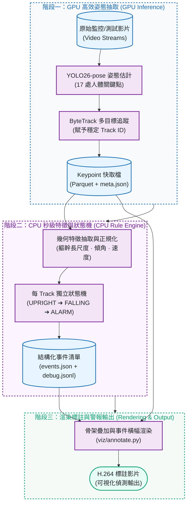
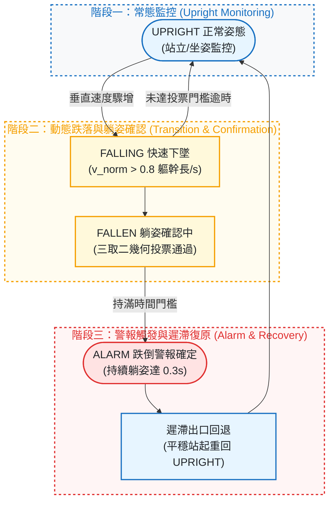

# fall-detection-pose

[](https://github.com/kuotunyu/fall-detection-pose/actions/workflows/ci.yml)


[](LICENSE)

[GitHub](https://github.com/kuotunyu) · [Hugging Face](https://huggingface.co/steven0226) · [→ 快速開始](#快速開始) · [→ 系統架構](#系統架構與-pipeline) · [→ 評估數據](#評估結果與對照) · [→ 失敗分析](#失敗分析)

以 **YOLO26-pose 預訓練模型 + ByteTrack 多目標追蹤**為基礎的解耦式 (Decoupled) 規則跌倒偵測系統。本專案重點在於工程嚴謹度與可解釋性：

- **可解釋的規則引擎**：每個 track 配置獨立狀態機（UPRIGHT → FALLING → FALLEN → ALARM），所有閾值集中於 [config.yaml](config.yaml)，各數值附選擇理由與文獻依據。
- **Event-level 誠實評估**：在 UR Fall Detection Dataset（30 falls + 40 ADL）上以明確定義的事件配對協定計算 Precision、Recall 與 F1；閾值僅在 tune split 搜尋，並透明公開兩輪評估紀錄。
- **深入失敗分析**：針對誤報 (FP) 與漏報 (FN) 提供特徵時序與幾何成因剖析，展示規則「為什麼」觸發或錯過。
- **推論與規則解耦**：GPU 僅需執行一次姿態抽取並落盤為 Keypoint Cache（Parquet 格式），後續調參、狀態判定與評估均為 CPU 秒級運算。

---

## 互動式展示 (Demo)

介面將標註影片、事件區間、Track ID 與實際觸發規則 (`Rules fired`) 整合呈現；無事件時顯示明確的 0 事件結論，避免空白表格。

<p align="center"><b>fall-06：實際 pipeline 輸出，Track 1 形成 ALARM 事件</b></p>
<p align="center"></p>

<p align="center"><b>adl-01：分析 150 影格、追蹤 1 人，未形成跌倒事件</b></p>
<p align="center"></p>

<details>
<summary><strong>展開手機版成果展示</strong></summary>

<p align="center"></p>

</details>

*媒體由 Gradio 介面實際執行完整 pipeline 擷取：`fall-06` 觸發 `v>v_fall_enter`、`posture_vote_confirmed`、`lying_persisted`；`adl-01` 輸出 0 事件。影片來源為 [UR Fall Detection Dataset](https://fenix.ur.edu.pl/~mkepski/ds/uf.html)（CC BY-NC-SA 4.0），依非商業作品集示範收錄。*

---

## 一眼看重點 (At a glance)

| 評測維度 | 指標項目 | 實測表現 |
|---|---|---:|
| 偵測效能 | Fixed test-split event-level F1 (yolo26n-pose) | 0.600 |
| 辨識特異度 | Fixed test-split video-level specificity (yolo26n-pose) | 0.741 |
| GPU 推論速度 | T4 FP16 端到端吞吐量 (yolo26n-pose) | 64.64 FPS |
| CPU 推論速度 | 2-vCPU CPU 端到端吞吐量 (yolo26n-pose) | 8.23 FPS |
| 測試覆蓋 | 離線單元測試套件 | 118 tests |

*F1 與 Specificity 來自固定 test split（20 falls + 27 ADL）；所有閾值僅在 tune split 搜尋。速度測試基於 150-frame `adl-01` 基準片段跑 3 次中位數所得。*

---

## 系統架構與 Pipeline

### 1. 推論與規則解耦端到端 Pipeline

只有 `extract`（GPU 姿態推論）為重運算步驟，其餘特徵提取與狀態判斷全部基於 Keypoint Parquet 快取，在 CPU 上秒級完成：



### 2. 狀態機轉移與收尾機制 (State Machine & Finalization)

每個 track 配置獨立狀態機，結合平滑濾波與遲滯設計：



---

## 判斷邏輯與幾何特徵

### 1. 關鍵幾何特徵
- **軀幹長尺度正規化**：計算肩中點 $S$ 與髖中點 $H$ 之距離 $L = \|H - S\|$，取滑動中位數 $\tilde{L}$ 作為尺度單位；所有距離與速度均以「軀幹長」為倍數，具備尺度與視角不變性。
- **軀幹傾角 $\theta$**：$\theta = \text{atan2}(|H_x - S_x|, H_y - S_y)$，直立約 0°、橫躺約 90°。
- **邊界框長寬比 $r$**：$r = w / h$。
- **髖-踝相對高度 $h_{\text{hip}}$**：$h_{\text{hip}} = (\text{踝}_y - H_y) / \tilde{L}$，站立時數值顯著大於躺姿（躺姿趨近 0）。
- **垂直速度 $v_{\text{norm}}$**：髖部座標經 3 點中位數濾波後計算差分速度，並以 $\tilde{L}$ 正規化，具備 FPS 採樣頻率不變性。

### 2. 躺姿 3 取 2 投票機制
為克服單一視角盲區（如朝鏡頭跌倒時 $r$ 變化不大、側躺時 $\theta$ 未達 90°），採用三取二投票判定躺姿：
$$\text{Lying} = \mathbb{I}(\theta > 40^\circ) + \mathbb{I}(r > r_{\text{lying}}) + \mathbb{I}(h_{\text{hip}} < h_{\text{hip\_lying}}) \ge 2$$

### 3. 關鍵校準閾值

| 參數名稱 | 校準值 | 意義與設計考量 |
|---|---|---|
| `kpt_conf_min` | 0.25 | 關鍵點可見度信心門檻 |
| `v_fall_enter` | 0.8 軀幹長/s | 進入 FALLING 狀態的垂直下墜速度門檻 |
| `theta_lying_enter` | 40° | 躺姿傾角判定門檻 |
| `window_confirm_s` / `vote_ratio` | 0.4s / 0.8 | 躺姿投票時序視窗與通過比例 |
| `t_confirm_fallen_s` | 0.3s | FALLEN 轉為 ALARM 的持續確認時長 |

---

## 評估結果與對照

### 1. Test Split 事件層級評估

| 模型架構 | Precision | Recall | F1 | Video-level Specificity |
|---|---|---|---|---|
| yolo26n-pose (預設) | 0.600 | 0.600 | 0.600 | 0.741 |
| yolo26s-pose | 0.611 | 0.550 | 0.579 | 0.778 |

### 2. 文獻公開數據量級對照

| 方法來源 | Precision | Recall / Sensitivity | F1 | 其他報告指標 |
|---|---:|---:|---:|---:|
| **本專案 (yolo26n-pose, test split)** | 0.600 | 0.600 | 0.600 | Specificity 0.741 |
| [Alam et al. 2024](https://arxiv.org/abs/2401.01587) (MoveNet 規則法) | 0.667 | 0.917 | — | Specificity 0.725 |
| [PIFR (2025)](https://doi.org/10.1371/journal.pone.0325253) | 0.888 | 0.941 | 0.914 | Specificity 0.956 |
| [Núñez-Marcos et al. 2017](https://doi.org/10.1155/2017/9474806) (CNN) | — | 1.000 | — | Specificity 0.920; Acc 0.950 |

*註：各文獻評估協定、容忍窗與切分方式皆有差異，數據僅供量級參考；本專案完整切分名單凍結於 [eval/splits.yaml](eval/splits.yaml)。*

---

## 效能基準測試 (Benchmark)

以固定 150 影格之 `adl-01.mp4` 測試 3 輪取中位數（詳見 [bench.json](bench.json)）：

| 模型架構 | 運行裝置 | 端到端 FPS | p50 延遲 | p95 延遲 |
|---|---|---|---|---|
| yolo26n-pose | GPU (T4) FP32 | 59.65 | 13.84ms | 23.52ms |
| yolo26n-pose | GPU (T4) FP16 | 64.64 | 15.63ms | 24.25ms |
| yolo26n-pose | CPU (2 vCPU) | 8.23 | 116.96ms | 178.96ms |
| yolo26s-pose | GPU (T4) FP32 | 72.25 | 13.88ms | 20.40ms |
| yolo26s-pose | GPU (T4) FP16 | 66.18 | 14.69ms | 24.09ms |
| yolo26s-pose | CPU (2 vCPU) | 3.36 | 271.15ms | 408.98ms |

---

## 深入失敗分析 (Failure Analysis)

- **漏報 (FN) — `fall-21`**：追蹤器在跌倒視覺特徵完全成形前遺失目標。全程軀幹傾角僅 0–6°，速度剛接近門檻 track 即消失，屬於**追蹤持續度**限制。
- **誤報 (FP) — `adl-34`**：受測者於 6 秒內反覆主動躺下與坐起（臥床動作）。系統正確識別出持續躺姿，但在 ADL 0-GT 協定下計為 FP，展示了幾何規則法在「主動臥床 vs. 跌倒臥地」上的分辨極限。
- **誤報 (FP) — `fall-08`**：實際為真實跌倒，但 ByteTrack 因姿態反彈斷成兩個 Track ID，第一段正確收尾 (TP)，第二段重新觸發判定為重複預測 (FP)，揭示了 Track 縫合與事件合併機制之間的邊界問題。

---

## 快速開始

### 本機 Demo 啟動

```bash
uv sync --locked --extra infer --extra demo
uv run python -m fall_detection.app.gradio_app --no-share
```

啟動後於瀏覽器開啟本機網址，上傳短片即可獲得標註影片與 `events.json`。

### 命令列工具 (CLI)

```bash
# 1. 核心依賴與離線單元測試
uv sync
uv run pytest
uv run ruff check .

# 2. 端到端處理管線
uv run fdp pipeline --source video.mp4 --out-dir outputs/

# 3. 效能基準測試
uv run fdp bench --video video.mp4 --model yolo26n-pose.pt --model yolo26s-pose.pt
```

---

## Colab / 完整重現 Notebooks

| Notebook 檔案 | 主要執行內容與說明 |
|---|---|
| [`01_smoke_test.ipynb`](notebooks/01_smoke_test.ipynb) | 2 支短片 (1 fall + 1 ADL) 端到端煙霧測試 |
| [`02_extract_urfd.ipynb`](notebooks/02_extract_urfd.ipynb) | URFD 全量下載與 Keypoint 快取抽取（唯一需 GPU 步驟） |
| [`03_tune_eval.ipynb`](notebooks/03_tune_eval.ipynb) | Tune split 網格調參、凍結組態與 Test 評估 |
| [`04_benchmark.ipynb`](notebooks/04_benchmark.ipynb) | FPS 與延遲基準矩陣測試 |
| [`05_gradio_demo.ipynb`](notebooks/05_gradio_demo.ipynb) | 於 Colab 環境啟動 Gradio 互動介面 |

---

## 專案結構

```text
fall-detection-pose/
├── pyproject.toml       # 依賴分層：core (規則引擎) / infer (GPU 推論) / demo (Gradio)
├── config.yaml          # 全域可調參數與選擇理由
├── eval/splits.yaml     # 凍結之 tune/test 切分名單
├── eval/metrics.json    # 評估原始數據
├── bench.json           # 基準測試原始數據
├── assets/              # 展示 GIF 與靜態圖
├── src/fall_detection/
│   ├── config.py         # Pydantic 參數驗證
│   ├── cli.py             # fdp 命令列工具
│   ├── io/                # H.264 影片編碼與 Parquet 快取處理
│   ├── inference/         # YOLO26-pose 與 ByteTrack 推論封裝
│   ├── rules/              # 幾何特徵計算、平滑濾波與 FSM 狀態機
│   ├── events/            # 事件定義與合併過濾
│   ├── viz/annotate.py    # 骨架與狀態橫幅標註渲染
│   ├── eval/               # 評估協定、配對與網格調參報告
│   └── app/gradio_app.py # Gradio 互動式應用程式
└── tests/                 # 離線單元測試套件 (118 tests)
```

---

## 授權與聲明

- 原始碼採用 [MIT License](LICENSE) 授權。
- 評估採用 [UR Fall Detection Dataset](https://fenix.ur.edu.pl/~mkepski/ds/uf.html)（CC BY-NC-SA 4.0，資料集不隨 repo 散布）：
  > Bogdan Kwolek, Michal Kepski, "Human fall detection on embedded platform using depth maps and wireless accelerometer", *Computer Methods and Programs in Biomedicine*, Vol. 117, Issue 3, 2014, pp. 489–501.
