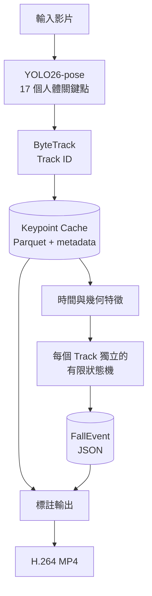
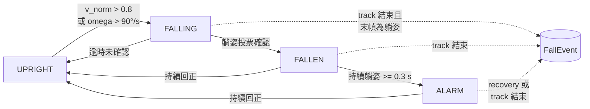

# FallSense：可解釋的姿態跌倒事件偵測

**正體中文** · [English](README.en.md)

[](https://github.com/kuotunyu/fall-detection-pose/actions/workflows/ci.yml)
[](https://github.com/kuotunyu/fall-detection-pose/releases/latest)


[](LICENSE)

FallSense 以 **YOLO26-pose** 擷取人體姿態、**ByteTrack** 延續 Track ID，再由可解釋的有限狀態機（UPRIGHT → FALLING → FALLEN → ALARM）判定跌倒事件。每次警示都保留事件時間、Track ID 與 `rules_fired`，讓結果不只回答「有沒有跌倒」，也能說明「為什麼觸發」。

[Demo](#demo) · [快速開始](#快速開始) · [系統架構](#系統架構) · [評估結果](#評估結果) · [失敗分析](#失敗分析failure-analysis) · [已知限制](#已知限制)

## 實測重點

| Test event-level F1 | ADL specificity | T4 · yolo26n FP16 | 2-vCPU · yolo26n | Offline tests |
| ---: | ---: | ---: | ---: | ---: |
| **0.600** | **0.741** | **64.64 FPS** | **8.23 FPS** | **118** |

測試集包含 20 段跌倒與 27 段 ADL；數據、切分名單、失敗案例與環境紀錄均已納入 repository。完整的評估限制與開發後修正揭露請見[評估結果](#評估結果)。

## Demo

介面在同一個工作區呈現標註影片、事件區間、Track ID、實際觸發規則與處理流程；沒有事件時會明確顯示 **0 個事件**，而不是留下空白結果。

**`fall-06`：實際 pipeline 輸出，Track 1 形成 ALARM 事件**


<details>
<summary><strong>查看 ADL 負例與窄螢幕版面</strong></summary>

**`adl-01`：分析 150 frames，維持 0 個事件**


**窄螢幕版面**


</details>

展示媒體由 Gradio 介面實際執行完整 pipeline 擷取，不是手工繪製的 mockup。影片來源為 [UR Fall Detection Dataset](https://fenix.ur.edu.pl/~mkepski/ds/uf.html)，適用條款見 [Third-party notices](THIRD_PARTY_NOTICES.md)。

## 為什麼這個專案值得看

- **可追溯的決策**：閾值集中於 [`config.yaml`](config.yaml)，事件輸出同時記錄 `rules_fired`、時間與 Track ID。
- **推論與規則解耦**：GPU 姿態推論只需執行一次並寫入 Keypoint Cache；調參、狀態判定與事件評估可直接在 CPU 重跑。
- **事件層級評估**：採用明確的一對一事件配對，而不是只報告 frame-level accuracy；ADL 中的任何預測都會計為 FP。
- **公開失敗證據**：不只列出 Precision、Recall 與 F1，也分析追蹤中斷、主動臥床及重複事件等具體失敗模式。
- **可重現工程流程**：`uv.lock` 鎖定依賴，GitHub Actions 在 Python 3.10／3.12 執行 Ruff 與 118 項 offline tests。

## 快速開始

需要 Python 3.10+ 與 [`uv`](https://docs.astral.sh/uv/)。首次推論時，Ultralytics 會下載 `yolo26n-pose.pt` 權重，因此需要網路連線；後續可重用本機快取。

### 啟動本機 Demo

```bash
git clone https://github.com/kuotunyu/fall-detection-pose.git
cd fall-detection-pose
uv sync --locked --extra infer --extra demo
uv run python -m fall_detection.app.gradio_app --no-share
```

開啟 <http://127.0.0.1:7860>，上傳短片即可取得標註影片、事件摘要與 `events.json`。

### 執行完整 Pipeline

```bash
uv run fdp pipeline \
  --source input.mp4 \
  --out-dir outputs \
  --config config.yaml \
  --debug
```

主要輸出：

| 檔案 | 內容 |
| --- | --- |
| `outputs/input.parquet` | 每個 frame／track 的 bounding box 與 17 個 pose keypoints |
| `outputs/input.parquet.meta.json` | 模型、影片雜湊、FPS、裝置與版本出處 |
| `outputs/input.events.json` | 事件時間、Track ID、峰值與 `rules_fired` |
| `outputs/input_annotated.mp4` | H.264 骨架、Track ID、狀態與警示標註影片 |
| `outputs/input.debug.jsonl` | `--debug` 啟用時輸出的逐幀特徵與狀態 |

<details>
<summary><strong>執行開發驗證</strong></summary>

```bash
uv sync --locked --group dev --extra demo
uv run ruff check .
uv run pytest -q
```

</details>

## 系統架構



Keypoint Cache 是 GPU inference 與 CPU rule engine 之間的穩定介面。Parquet schema 具有版本檢查，metadata 同時嵌入檔案並寫入 sidecar；不相容的 cache 會 fail fast，避免版本漂移污染評估結果。

### Track-level 狀態機



每個 Track ID 都有獨立狀態，不會因另一個人觸發警示而共用事件。影片結束或 track 消失時，finalization 會依最後狀態決定是否輸出事件，處理跌倒後片段立即結束的情況。

## 可解釋的判定依據

| 特徵 | 定義與用途 |
| --- | --- |
| `theta_deg` | 肩膀中點至髖部中點相對鉛直方向的軀幹角度；直立約 0°、橫躺約 90° |
| `bbox_aspect` | 人體 bounding box 的寬高比 |
| `h_hip` | 踝部中點與髖部中點的垂直差，除以滑動中位數軀幹長度；用來表示髖踝相對高度，而非直接量測離地高度 |
| `v_norm` | 髖部垂直速度除以滑動中位數軀幹長度，以實際時間差分計算 |
| `omega` | 軀幹角度變化率 |

主要防誤報設計：

- **Posture voting**：`theta_deg`、`bbox_aspect` 與 `h_hip` 採三取二，並要求滑動視窗內足夠比例的 frames 通過。
- **Persistence**：進入 FALLEN 後仍需持續躺姿，才會形成 ALARM。
- **Hysteresis**：回復直立採用不同門檻與持續時間，避免狀態在臨界值來回跳動。
- **Missing-data handling**：踝部不可見時，`h_hip` 不參與投票；系統不會捏造不可得的特徵。
- **Finalization**：影片或 track 結束時檢查末端姿態，降低片尾事件漏報。

尺度與時間正規化可降低人物大小及 FPS 差異造成的影響，但不代表對攝影機視角具有不變性。

## 評估結果

### 評估協定

- 使用固定 random seed 42，分為 tune split（10 falls + 13 ADL）與 test split（20 falls + 27 ADL）。
- Ground-truth 區間前後各擴張 **0.5 秒**；預測與擴張後區間有正時間交集才列為候選。
- 依 ground truth 的時間順序，選擇尚未使用且交集最大的預測，執行 greedy one-to-one matching。
- ADL 影片沒有 ground-truth fall；任何預測事件都計為 FP。
- 所有規則閾值僅使用 tune split 搜尋；同一組凍結閾值用於兩個 pose 模型的 test 評估。

切分名單與原始結果位於 [`eval/splits.yaml`](eval/splits.yaml) 與 [`eval/metrics.json`](eval/metrics.json)。

| 方法 | TP / FP / FN | Test precision | Test recall | Test F1 | ADL specificity |
| --- | ---: | ---: | ---: | ---: | ---: |
| **YOLO26n-pose（預設）** | **12 / 8 / 8** | **0.600** | **0.600** | **0.600** | **0.741** |
| YOLO26s-pose | 11 / 7 / 9 | 0.611 | 0.550 | 0.579 | 0.778 |

> [!NOTE]
> 第一次查看 test 結果後，專案修正了事件 finalization 的結構性錯誤，再執行第二輪評估。因此最終數字是透明揭露的 **post-development estimates**，不應解讀為完全未觸碰的一次性 holdout。完整兩輪紀錄保留於 `eval/metrics.json`。

> [!CAUTION]
> 跌倒偵測文獻常使用不同的資料切分、時間容忍範圍與評估單位；若未在相同協定下重跑，不應將數字放入同一 leaderboard 直接排名。相關方法背景可參考 [PIFR（2025）](https://doi.org/10.1371/journal.pone.0325253) 與 [Núñez-Marcos et al.（2017）](https://doi.org/10.1155/2017/9474806)。

## 效能測試

Benchmark 使用 URFD `adl-01` 重建的 640×480、30 FPS 影片。該影片實際只有 150 frames；每個設定執行 3 次並取中位數。環境與原始紀錄位於 [`bench.json`](bench.json)。

| 環境 | 模型 / 精度 | End-to-end FPS | p50 latency | p95 latency |
| --- | --- | ---: | ---: | ---: |
| NVIDIA T4 | yolo26n-pose / FP32 | 59.65 | 13.84 ms | 23.52 ms |
| NVIDIA T4 | yolo26n-pose / FP16 | **64.64** | 15.63 ms | 24.25 ms |
| 2-vCPU | yolo26n-pose / FP32 | **8.23** | 116.96 ms | 178.96 ms |
| NVIDIA T4 | yolo26s-pose / FP32 | 72.25 | 13.88 ms | 20.40 ms |
| NVIDIA T4 | yolo26s-pose / FP16 | 66.18 | 14.69 ms | 24.09 ms |
| 2-vCPU | yolo26s-pose / FP32 | 3.36 | 271.15 ms | 408.98 ms |

這組短 benchmark 中，較小的 `n` 模型沒有在每種設定都更快，`s` 模型的 FP16 也慢於 FP32；結果可能受 warm-up、共享 T4 負載與量測波動影響，不宜解讀為普遍的模型速度排序。

## 失敗分析（Failure Analysis）

依 `eval/metrics.json` 的 FP／FN 清單回看特徵時序與畫面後，代表性案例包括：

- **`fall-21`（FN）**：追蹤器在跌倒姿態完全形成前遺失目標；軀幹角度仍低時 track 已中斷，限制主要來自追蹤持續度。
- **`adl-34`（FP）**：受測者主動躺下再坐起。幾何上確實形成持續躺姿，但依 ADL 的 0-GT 協定仍計為 FP，顯示單靠姿態難以區分「主動臥床」與「意外跌倒」。
- **`fall-08`（重複預測 FP）**：真實跌倒期間 Track ID 斷裂；第一段已正確配對，第二段再次觸發成為未配對預測，揭示 track stitching 與 event merging 的邊界問題。

公開這些案例的目的不是替指標辯護，而是界定系統目前能可靠處理與尚未處理的問題。

## 已知限制

- 本專案是研究與工程驗證用 prototype，不是醫療器材，也不能取代緊急通報系統。
- `config.yaml` 的閾值由 URFD tune split 選出；更換攝影機角度、場域或族群時需要重新校準。
- 慢速倒地、遮擋、主動躺下及複雜多人互動仍可能造成漏報或誤報。
- 多人嚴重遮擋下的 Track ID 穩定性與跨資料集 generalization 尚未完成系統性驗證。
- ONNX／TensorRT 匯出與 edge device 效能不在目前的驗證範圍。

## 重現流程與 Notebooks

Notebooks 用於重現開發、校準與評估流程，不是觀看 Demo 的必要步驟。

| Notebook | 用途 |
| --- | --- |
| [`01_smoke_test.ipynb`](notebooks/01_smoke_test.ipynb) | 兩段短片的 end-to-end smoke test |
| [`02_extract_urfd.ipynb`](notebooks/02_extract_urfd.ipynb) | 下載 URFD 並建立 Keypoint Cache |
| [`03_tune_eval.ipynb`](notebooks/03_tune_eval.ipynb) | Tune split 閾值搜尋與 test 評估 |
| [`04_benchmark.ipynb`](notebooks/04_benchmark.ipynb) | GPU／CPU benchmark |
| [`05_gradio_demo.ipynb`](notebooks/05_gradio_demo.ipynb) | 在 Colab 啟動 Gradio Demo |

## 專案結構

```text
fall-detection-pose/
├── src/fall_detection/
│   ├── app/                      # Gradio Demo 與呈現層
│   ├── inference/                # YOLO26-pose 與 ByteTrack
│   ├── rules/                    # 特徵、平滑與狀態機
│   ├── events/                   # 事件 schema、合併與序列化
│   ├── eval/                     # 事件配對與指標計算
│   ├── viz/                      # H.264 標註影片輸出
│   └── cli.py                    # `fdp` 命令列入口
├── tests/                        # 118 項 offline tests
├── notebooks/                    # 重現與評估流程
├── eval/                         # 切分、指標與失敗分析
├── assets/                       # README 展示素材
├── config.yaml                   # 可解釋規則與閾值
├── bench.json                    # 效能測試原始紀錄
├── pyproject.toml                # 依賴、CLI 與工具設定
└── uv.lock                       # 鎖定依賴版本
```

## 授權與資料來源

原始程式碼以 [MIT License](LICENSE) 釋出。

評估使用 [UR Fall Detection Dataset](https://fenix.ur.edu.pl/~mkepski/ds/uf.html)。本 repository 不重新散布原始資料；資料集與衍生展示媒體依 **CC BY-NC-SA 4.0** 使用，完整歸屬與適用範圍見 [Third-party notices](THIRD_PARTY_NOTICES.md)。

資料集論文：[Kwolek & Kepski, 2014](https://doi.org/10.1016/j.cmpb.2014.09.005)。
