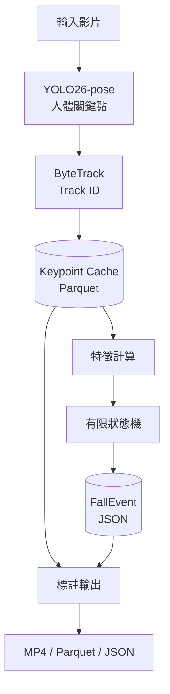
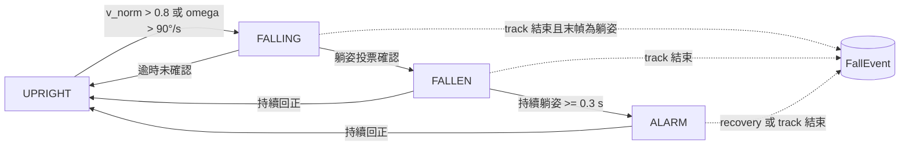

# FallSense：可解釋的姿態跌倒偵測

[](https://github.com/kuotunyu/fall-detection-pose/actions/workflows/ci.yml)


[](LICENSE)

以 **YOLO26-pose 預訓練模型 + ByteTrack 多目標追蹤** 為基礎的可解釋規則式跌倒偵測系統。系統先擷取人體姿態與 Track ID，再以有限狀態機（UPRIGHT → FALLING → FALLEN → ALARM）輸出事件；每次判定都保留觸發時間、Track ID 與 Rules fired，便於檢查系統「為什麼」發出警示。

- **可解釋**：姿態角度、正規化速度與持續時間等閾值集中於 [`config.yaml`](config.yaml)，並附選擇依據。
- **事件層級評估**：以明確的一對一配對規則計算 Precision、Recall、F1 與 ADL specificity。
- **推論與規則解耦**：GPU 只需執行一次姿態推論並輸出 Keypoint Cache；規則調整與評估可在 CPU 快速重跑。
- **可重現**：依賴由 `uv.lock` 鎖定，CI 執行 Ruff 與完整測試套件。

## 一眼看重點

| Test event-level F1 | ADL specificity | T4 · yolo26n FP16 | 2-vCPU · yolo26n | Offline tests |
| ---: | ---: | ---: | ---: | ---: |
| **0.600** | **0.741** | **64.64 FPS** | **8.23 FPS** | **118** |

> [!NOTE]
> 測試集包含 20 段跌倒與 27 段 ADL。閾值僅使用 tune split 搜尋；第一次查看 test 結果後曾修正事件 finalization 的結構性錯誤，再執行最終評估。因此這組數字是透明揭露的 post-development estimate，不應視為完全未觸碰的一次性 holdout。速度數據來自固定 150 frames 影片、3 次執行的中位數，僅代表該測試環境。

## 互動式展示（Demo）

介面將標註影片、事件區間、Track ID、Rules fired 與處理流程集中呈現；無事件時會明確顯示 0 事件，而不是留下空白區域。

**fall-06：實際 pipeline 輸出，Track 1 形成 ALARM 事件**


**adl-01：ADL 負例，150 frames 內維持 0 個事件**


**窄螢幕版面**


```bash
uv sync --locked --extra infer --extra demo
uv run python -m fall_detection.app.gradio_app --no-share
```

瀏覽器開啟 <http://127.0.0.1:7860> 後即可上傳短片。首次分析時，Ultralytics 會下載 `yolo26n-pose.pt` 權重，因此需要網路連線；之後可重用本機快取。

## 系統架構與 Pipeline



### Track-level 狀態機



每個 Track ID 都有獨立狀態，不會因另一人觸發警示而共用事件。影片結束或 track 消失時，finalization 邏輯會依最後狀態決定是否輸出事件，避免片段在跌倒後立即結束而漏報。

## 判定依據

規則使用五類可直接檢查的姿態特徵：

| 特徵 | 用途 |
| --- | --- |
| `theta_deg` | 肩膀中點至髖部中點相對鉛直方向的軀幹角度 |
| `bbox_aspect` | 人體 bounding box 的寬高比 |
| `h_hip` | 髖部相對地面的高度 |
| `v_norm` | 以軀幹長度正規化的垂直速度 |
| `omega` | 軀幹角度變化率 |

其中 `v_norm` 以實際時間差分計算，降低不同 FPS 對速度閾值的影響；以軀幹長度正規化則可降低人物在畫面中尺寸差異的影響，但不代表對鏡頭角度具有不變性。

主要防誤報設計：

- **Posture voting**：滑動視窗內需有足夠幀數符合躺姿，單幀異常不會直接觸發。
- **Persistence**：進入 FALLEN 後仍需持續躺姿，才會形成 ALARM。
- **Hysteresis**：回復直立使用不同條件與持續時間，避免狀態在臨界值來回跳動。
- **Finalization**：影片或 track 結束時檢查末端姿態，處理跌倒發生在片尾的情況。

## 評估結果

### 評估協定

- 將 ground-truth 區間前後各擴張 **0.5 秒**；預測區間與擴張後區間有正時間交集，才列為候選配對。
- 依 ground truth 的時間順序，選擇尚未使用且交集最大的預測，執行 greedy one-to-one matching；一個預測不能同時配對多個真實事件。
- ADL 影片沒有 ground-truth fall；任何預測事件都計為 FP。
- Tune split 用於選擇閾值，test split 只用於最終報告；前述 finalization 修正例外已在本頁明確揭露。

切分名單與原始結果分別位於 [`eval/splits.yaml`](eval/splits.yaml) 與 [`eval/metrics.json`](eval/metrics.json)。

| 方法 | Test precision | Test recall | Test F1 | ADL specificity |
| --- | ---: | ---: | ---: | ---: |
| **YOLO26n-pose（預設）** | **0.600** | **0.600** | **0.600** | **0.741** |
| YOLO26s-pose | 0.611 | 0.550 | 0.579 | 0.778 |

> [!CAUTION]
> 公開文獻常使用不同的資料切分、時間容忍範圍與評估單位；若沒有在相同協定下重跑，不應把數字放入同一 leaderboard 直接排名。本專案因此只並列相同 test split、相同規則閾值下的兩個 pose 模型。

相關方法背景可參考 [PIFR（2025）](https://doi.org/10.1371/journal.pone.0325253) 與 [Núñez-Marcos et al.（2017）](https://doi.org/10.1155/2017/9474806)。

## 效能測試

Benchmark 固定使用 150 frames 已解碼影片，各設定執行 3 次並取中位數。以下數值屬於環境特定結果，不代表所有 GPU、CPU 或影片解析度。

| 環境 | 模型 / 精度 | End-to-end FPS | p50 latency | p95 latency |
| --- | --- | ---: | ---: | ---: |
| NVIDIA T4 | yolo26n-pose / FP32 | 59.65 | 13.84 ms | 23.52 ms |
| NVIDIA T4 | yolo26n-pose / FP16 | **64.64** | 15.63 ms | 24.25 ms |
| 2-vCPU | yolo26n-pose / FP32 | **8.23** | 116.96 ms | 178.96 ms |
| NVIDIA T4 | yolo26s-pose / FP32 | 72.25 | 13.88 ms | 20.40 ms |
| NVIDIA T4 | yolo26s-pose / FP16 | 66.18 | 14.69 ms | 24.09 ms |
| 2-vCPU | yolo26s-pose / FP32 | 3.36 | 271.15 ms | 408.98 ms |

在這組短 benchmark 中，較小的 `n` 模型沒有在每種設定都更快，而 `s` 模型的 FP16 也慢於 FP32；結果可能受 warm-up、共享 T4 負載與量測波動影響，不宜解讀成普遍的模型速度排序。原始資料與執行環境記錄於 [`bench.json`](bench.json)。

## 失敗分析（Failure Analysis）

依 [`eval/metrics.json`](eval/metrics.json) 的 FP／FN 清單回看特徵時序與畫面後，代表性案例包括：

- **`fall-21`（FN）**：追蹤器在跌倒姿態完全形成前遺失目標；軀幹角度仍低時 track 已中斷，顯示主要限制在追蹤持續度。
- **`adl-34`（FP）**：受測者主動躺下再坐起。幾何上確實形成持續躺姿，但依 ADL 的 0-GT 協定仍計為 FP，反映規則法難以單靠姿態區分「主動臥床」與「意外跌倒」。
- **`fall-08`（重複預測 FP）**：真實跌倒期間 Track ID 斷裂；第一段已正確配對，第二段再次觸發而成為未配對預測，顯示 track stitching 與 event merging 仍有改善空間。

## 已知限制

- 本專案是研究與工程驗證用 prototype，不是醫療器材，也不能取代緊急通報系統。
- `config.yaml` 的閾值由 URFD tune split 選出；換攝影機角度、場域或族群時需要重新校準。
- 慢速倒地、遮擋與複雜多人互動仍可能漏報或誤報。
- 多人嚴重遮擋下的 Track ID 穩定性，以及跨資料集 generalization，尚未完成系統性驗證。
- ONNX／TensorRT 匯出與 edge device 效能不在目前驗證範圍。

## 快速開始

### 安裝與測試

```bash
git clone https://github.com/kuotunyu/fall-detection-pose.git
cd fall-detection-pose
uv sync --locked --group dev --extra demo
uv run ruff check .
uv run pytest -q
```

### 執行完整 Pipeline

```bash
uv sync --locked --extra infer
uv run fdp pipeline --source input.mp4 --out-dir outputs --config config.yaml
```

主要輸出：

- `outputs/input.parquet`：姿態關鍵點與 Track ID cache。
- `outputs/input.events.json`：事件時間、Track ID 與 Rules fired。
- `outputs/input_annotated.mp4`：姿態骨架、Track ID 與狀態標註影片。

加上 `--debug` 可另外輸出逐幀特徵與狀態的 `input.debug.jsonl`。

## Notebooks

以下 notebooks 用於重現開發與評估流程，不是觀看 Demo 的必要步驟：

- [`01_smoke_test.ipynb`](notebooks/01_smoke_test.ipynb)：兩段短片的端到端 smoke test。
- [`02_extract_urfd.ipynb`](notebooks/02_extract_urfd.ipynb)：下載 URFD 並建立 Keypoint Cache。
- [`03_tune_eval.ipynb`](notebooks/03_tune_eval.ipynb)：Tune split 閾值搜尋與 test 評估。
- [`04_benchmark.ipynb`](notebooks/04_benchmark.ipynb)：GPU／CPU benchmark。
- [`05_gradio_demo.ipynb`](notebooks/05_gradio_demo.ipynb)：在 Colab 啟動 Gradio Demo。

## 專案結構

```text
fall-detection-pose/
├── .github/workflows/ci.yml      # GitHub Actions：Ruff + pytest
├── src/fall_detection/           # 核心 Python package
│   ├── app/                      # Gradio Demo 與介面呈現
│   ├── inference/                # YOLO26-pose 與 ByteTrack
│   ├── rules/                    # 特徵、平滑與狀態機
│   ├── eval/                     # 事件配對與指標計算
│   ├── viz/                      # 標註影片輸出
│   └── cli.py                    # `fdp` 命令列入口
├── notebooks/                    # Colab smoke test 與評估流程
├── scripts/                      # 資料下載、評估、benchmark 工具
├── tests/                        # Offline unit / integration tests
├── eval/                         # 指標、逐片結果與失敗分析
├── assets/                       # README 展示素材
├── config.yaml                   # 可解釋規則與閾值
├── bench.json                    # 效能測試原始紀錄
├── pyproject.toml                # 依賴、CLI 與工具設定
└── uv.lock                       # 鎖定依賴版本
```

## 授權與資料來源

程式碼以 [MIT License](LICENSE) 釋出。

評估使用 [UR Fall Detection Dataset](http://fenix.univ.rzeszow.pl/~mkepski/ds/uf.html)。資料集與衍生展示媒體依其原始授權 **CC BY-NC-SA 4.0** 使用，僅限非商業研究與作品集展示；本 repository 不重新散布原始資料，下載腳本會連至官方來源。資料集論文：[Kwolek & Kepski, 2014](https://doi.org/10.1016/j.cmpb.2014.09.005)。
